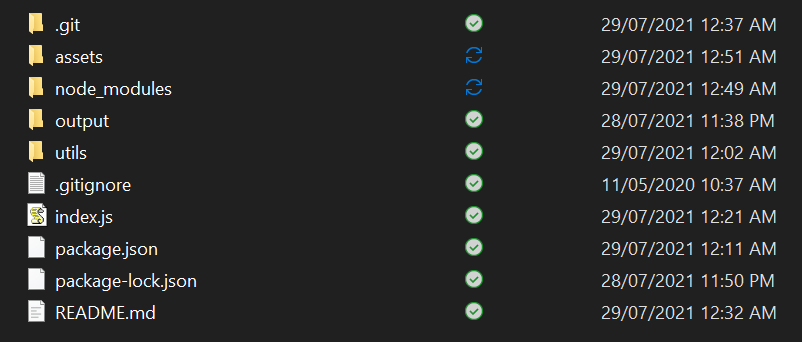
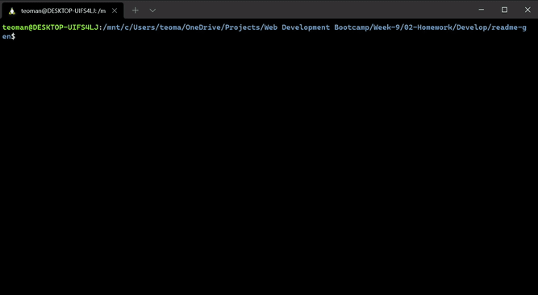

# ReadmeGen
  
<br>

## Description
JavaScript CLI Readme Generator

## Table of Contents
* [Description](#description)
* [Installation/Usage](#installation/usage)
* [Usage](#usage)
* [License](#license)
* [Credit](#credit)
* [Contact](#contact)

## Installation/Usage
```
$ git clone https://github.com/untitledeveloper/readme-gen.git
$ cd readme-gen
$ npm install inquirer
$ node index.js
```

##### *You can also refer to gif below*

The root repo directory will look something like this after cloning

 <br>
*Root repo directory* <br>

 <br>
*Gif showing usage* <br>

## License

<br>
ISC license. 

## Credit
* img.sheilds.io 
* www.npmjs.com/package/inquirer#documentation
* developer.mozilla.org/en-US/


## Contact

Github: [untitledeveloper](https://github.com/untitledeveloper)<br>
Email: teoman.h.aydogan@gmail.com<br>
    